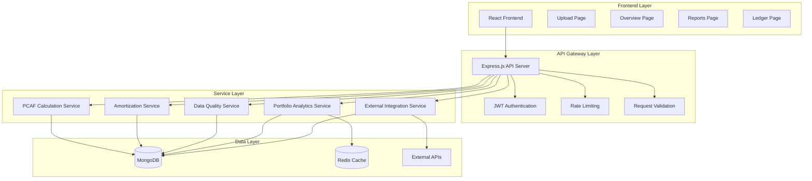

# Design Document

## Overview

This design outlines the creation of a unified, production-ready backend system for the PCAF loan management platform. The system will integrate all existing backend components, implement missing functionality from the tasks.md roadmap, and replace sample data with realistic mock data that demonstrates real-world PCAF compliance scenarios.

The backend will serve as a comprehensive API supporting the existing React frontend, providing PCAF-compliant emissions calculations, loan portfolio management, amortization tracking, and regulatory reporting capabilities.

## Architecture

### High-Level Architecture



### Service Architecture

The backend follows a layered service architecture with clear separation of concerns:

1. **API Layer**: Express.js routes with middleware for authentication, validation, and rate limiting
2. **Service Layer**: Business logic services for PCAF calculations, portfolio management, and data processing
3. **Data Access Layer**: Mongoose models with proper validation and indexing
4. **Integration Layer**: External API clients for vehicle data and emission factors
5. **Caching Layer**: Redis for performance optimization and session management

## Components and Interfaces

### Core API Endpoints

#### Loan Management API
- `POST /api/v1/loans/intake` - Single loan intake with validation and emissions calculation
- `POST /api/v1/loans/bulk-intake` - Bulk loan processing with batch validation
- `GET /api/v1/loans/portfolio` - Portfolio summary with aggregated metrics
- `GET /api/v1/loans/:loanId` - Detailed loan information with emissions data
- `PUT /api/v1/loans/:loanId` - Loan updates with recalculation triggers
- `DELETE /api/v1/loans/:loanId` - Soft delete with audit trail

#### Portfolio Analytics API
- `GET /api/v1/portfolio/summary` - Comprehensive portfolio metrics and PCAF compliance
- `GET /api/v1/portfolio/historical` - Time-series emissions data and trends
- `GET /api/v1/portfolio/data-quality` - Data quality assessment and recommendations

#### Reporting API
- `GET /api/v1/reports/compliance` - PCAF compliance reports with scope separation
- `GET /api/v1/reports/emissions` - Detailed emissions reports with attribution factors
- `POST /api/v1/reports/generate` - Custom report generation with export options

#### Integration API
- `POST /api/v1/integrations/lms/sync` - LMS synchronization with incremental updates
- `GET /api/v1/integrations/emission-factors` - Current emission factors by region/vehicle type
- `POST /api/v1/integrations/vehicle-lookup` - Vehicle specification lookup and validation

### Service Interfaces

#### PCAF Calculation Service
```typescript
interface PCAFCalculationService {
  calculateFinancedEmissions(loanId: string, inputs: CalculationInputs): Promise<PCAFCalculationResult>
  batchCalculateFinancedEmissions(calculations: BatchCalculationInput[]): Promise<BatchCalculationResult[]>
  recalculatePortfolioEmissions(portfolioId: string, reportingDate: Date): Promise<PortfolioEmissionsResult>
  validateCalculationInputs(inputs: CalculationInputs): ValidationResult
}
```

#### Amortization Service
```typescript
interface AmortizationService {
  generateAmortizationSchedule(loanDetails: LoanDetails): Promise<AmortizationSchedule>
  calculateBalanceAsOfDate(loanId: string, asOfDate: Date): Promise<BalanceCalculation>
  processPayment(loanId: string, payment: PaymentDetails): Promise<PaymentResult>
  handleLifecycleEvent(loanId: string, event: LifecycleEvent): Promise<LifecycleResult>
}
```

#### Data Quality Service
```typescript
interface DataQualityService {
  assessDataQuality(loanData: LoanData): Promise<DataQualityAssessment>
  calculatePCAFScore(inputs: CalculationInputs): DataQualityScore
  generateQualityReport(portfolioId: string): Promise<QualityReport>
  getImprovementRecommendations(assessment: DataQualityAssessment): QualityRecommendation[]
}
```

## Data Models

### Enhanced Loan Portfolio Item
```typescript
interface LoanPortfolioItem {
  loan_id: string
  borrower_name: string
  loan_amount: number
  outstanding_balance: number
  interest_rate: number
  term_months: number
  origination_date: Date
  vehicle_details: VehicleDetails
  emissions_data: EmissionsData
  amortization: AmortizationData
  lifecycle_events: LifecycleEvent[]
  data_quality_assessment: DataQualityAssessment
  audit_trail: AuditEntry[]
  is_deleted: boolean
  created_at: Date
  updated_at: Date
}
```

### Vehicle Details with Enhanced Specifications
```typescript
interface VehicleDetails {
  make: string
  model: string
  year: number
  type: VehicleType
  fuel_type: FuelType
  value_at_origination: number
  efficiency_mpg?: number
  annual_mileage?: number
  vin?: string
  engine_size?: number
  transmission_type?: string
  drivetrain?: string
  weight_class?: string
  epa_rating?: EPARating
}
```

### PCAF Emissions Data
```typescript
interface EmissionsData {
  annual_emissions_tco2e: number
  attribution_factor: number
  financed_emissions_tco2e: number
  scope_1_emissions: number
  scope_2_emissions: number
  scope_3_emissions: number
  data_quality_score: number
  pcaf_data_option: PCAFOption
  calculation_method: string
  emission_factor_source: string
  last_calculated: Date
  calculation_metadata: CalculationMetadata
}
```

### Realistic Mock Data Structure
```typescript
interface MockDataSet {
  loans: MockLoanData[]
  vehicles: MockVehicleData[]
  emissionFactors: MockEmissionFactor[]
  borrowers: MockBorrowerData[]
  paymentHistories: MockPaymentHistory[]
}
```

## Error Handling

### Standardized Error Response Format
```typescript
interface APIError {
  error: {
    code: string
    message: string
    details?: any
    timestamp: string
    request_id: string
    validation_errors?: ValidationError[]
  }
}
```

### Error Categories
1. **Validation Errors** (400): Invalid input data, schema violations
2. **Authentication Errors** (401): Invalid or missing JWT tokens
3. **Authorization Errors** (403): Insufficient permissions
4. **Not Found Errors** (404): Resource not found
5. **Business Logic Errors** (422): PCAF calculation failures, data quality issues
6. **Integration Errors** (502): External service failures
7. **Server Errors** (500): Unexpected system errors

### Error Handling Strategy
- Comprehensive error logging with correlation IDs
- Graceful degradation for external service failures
- Detailed validation error messages for client debugging
- Automatic retry mechanisms for transient failures
- Circuit breaker pattern for external integrations

## Testing Strategy

### Unit Testing
- **Service Layer**: Test all PCAF calculations, amortization logic, and data quality assessments
- **Model Layer**: Test Mongoose schema validation and business rules
- **Utility Functions**: Test data transformation and validation utilities
- **Mock Data Generation**: Test realistic data generation functions

### Integration Testing
- **API Endpoints**: Test complete request/response cycles with test database
- **Database Operations**: Test complex queries and data integrity
- **External Integrations**: Test with mocked external services
- **Authentication Flow**: Test JWT token validation and user authorization

### End-to-End Testing
- **Complete Workflows**: Test loan intake through emissions reporting
- **Data Quality Scenarios**: Test various data quality levels and PCAF options
- **Performance Testing**: Test with large portfolios (10,000+ loans)
- **Error Scenarios**: Test error handling and recovery mechanisms

### Mock Data Testing
- **Realistic Scenarios**: Test with diverse vehicle types and loan terms
- **PCAF Compliance**: Verify calculations match expected PCAF methodology
- **Data Quality Variations**: Test all PCAF data quality options (1a-3b)
- **Edge Cases**: Test boundary conditions and unusual loan scenarios

## Implementation Approach

### Phase 1: Core Backend Infrastructure
1. Complete existing service implementations
2. Implement missing API routes and controllers
3. Add comprehensive error handling and logging
4. Set up proper database indexing and optimization

### Phase 2: PCAF Calculation Engine
1. Enhance PCAF calculation service with all methodology options
2. Implement data quality assessment algorithms
3. Add emission factor management and external integration
4. Create comprehensive calculation audit trails

### Phase 3: Realistic Mock Data Generation
1. Create diverse vehicle loan portfolios with realistic distributions
2. Generate proper amortization schedules and payment histories
3. Implement varied data quality scenarios
4. Add lifecycle events and portfolio changes over time

### Phase 4: Advanced Features
1. Implement bulk processing and batch operations
2. Add portfolio analytics and trend analysis
3. Create comprehensive reporting capabilities
4. Implement external system integrations

### Phase 5: Production Readiness
1. Add comprehensive monitoring and health checks
2. Implement performance optimization and caching
3. Add security hardening and rate limiting
4. Create deployment and scaling configurations

## Security Considerations

### Authentication and Authorization
- JWT-based authentication with Clerk integration
- Role-based access control (RBAC) for different user types
- API key management for external integrations
- Session management with Redis

### Data Protection
- Encryption at rest for sensitive loan data
- Encryption in transit with HTTPS/TLS
- PII data masking in logs and error messages
- Secure handling of financial information

### API Security
- Rate limiting to prevent abuse
- Input validation and sanitization
- SQL injection prevention through Mongoose ODM
- CORS configuration for frontend integration

## Performance Optimization

### Database Optimization
- Proper indexing for common query patterns
- Connection pooling for high concurrency
- Query optimization for large portfolios
- Data archiving strategies for historical data

### Caching Strategy
- Redis caching for frequently accessed data
- Calculation result caching with TTL
- Session caching for authentication
- API response caching for static data

### Scalability Considerations
- Horizontal scaling with load balancers
- Database sharding for large datasets
- Microservice architecture preparation
- Queue-based processing for bulk operations

This design provides a comprehensive foundation for creating a unified, production-ready backend that supports all frontend functionality while maintaining PCAF compliance and providing realistic mock data for testing and demonstration purposes.