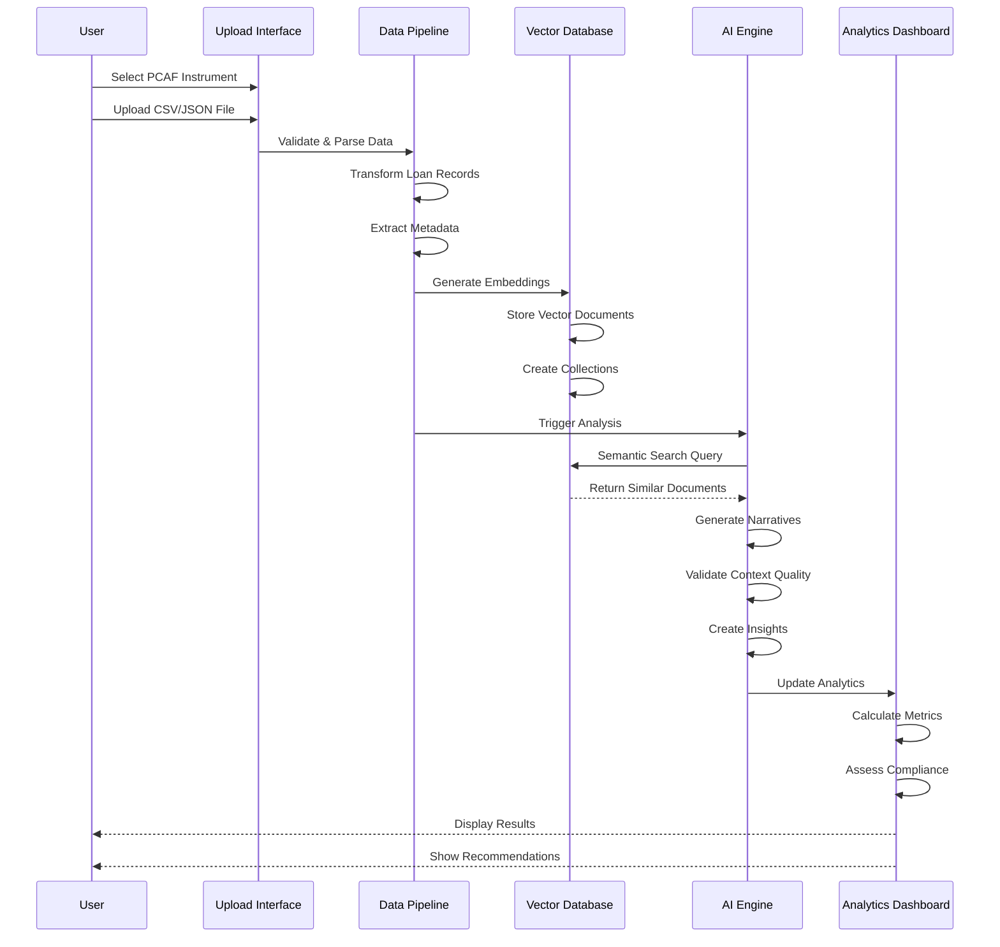
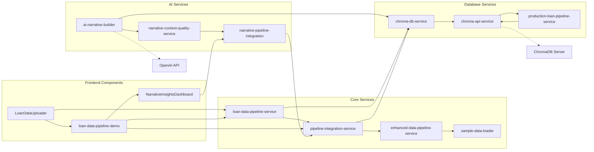
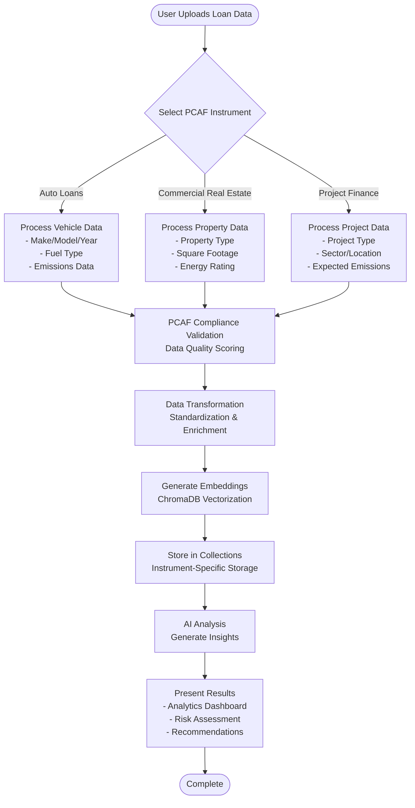
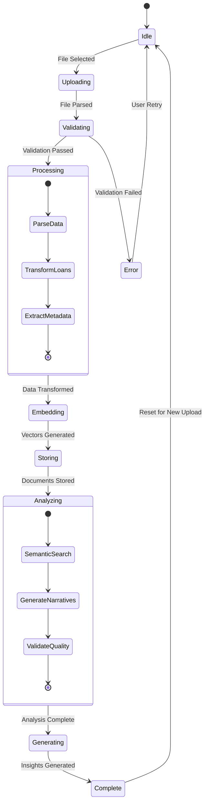
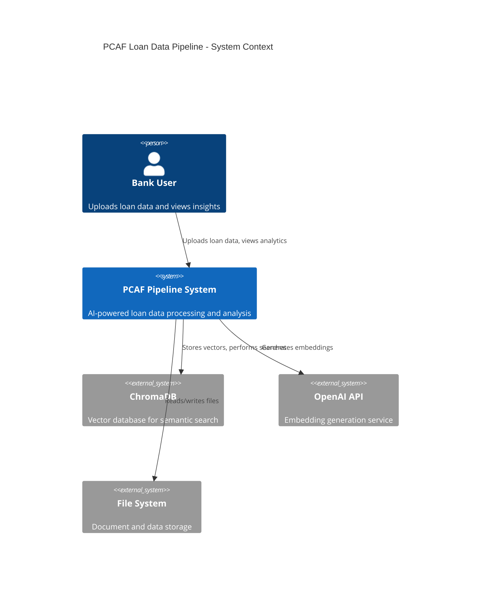

# PCAF AI-Powered Loan Data Pipeline - Master System Architecture

## Complete System Architecture Flowchart

```mermaid
graph TB
    %% User Interface Layer
    subgraph "User Interface Layer"
        UI1[Loan Data Uploader<br/>LoanDataUploader.tsx]
        UI2[Pipeline Demo Page<br/>loan-data-pipeline-demo.tsx]
        UI3[Narrative Insights Dashboard<br/>NarrativeInsightsDashboard.tsx]
        UI4[Pipeline Monitor<br/>PipelineMonitor.tsx]
    end

    %% Data Input Layer
    subgraph "Data Input & Validation Layer"
        INPUT1[File Upload<br/>CSV/JSON]
        INPUT2[PCAF Instrument Selection<br/>Auto Loans | CRE | Project Finance]
        INPUT3[Sample Data Generator<br/>sample-data-loader.ts]
        VALID1[Data Validation<br/>Schema & PCAF Compliance]
    end

    %% Core Processing Layer
    subgraph "Core Data Processing Pipeline"
        PROC1[Loan Data Pipeline Service<br/>loan-data-pipeline-service.ts]
        PROC2[Enhanced Data Pipeline<br/>enhanced-data-pipeline-service.ts]
        PROC3[Pipeline Integration Service<br/>pipeline-integration-service.ts]
        PROC4[Data Transformation<br/>Multi-Instrument Processing]
    end

    %% AI & Vector Database Layer
    subgraph "AI & Vector Database Layer"
        subgraph "Development Environment"
            CHROMA1[Mock ChromaDB Service<br/>chroma-db-service.ts]
        end
        
        subgraph "Production Environment"
            CHROMA2[ChromaDB API Service<br/>chroma-api-service.ts]
            CHROMA3[Production Pipeline Bridge<br/>production-loan-pipeline-service.ts]
        end
        
        EMBED1[Document Embedding<br/>Vector Generation]
        EMBED2[Collection Management<br/>Instrument-Specific Storage]
    end

    %% AI Analysis Engine
    subgraph "AI Analysis & Insights Engine"
        AI1[AI Narrative Builder<br/>ai-narrative-builder.ts]
        AI2[Context Quality Service<br/>narrative-context-quality-service.ts]
        AI3[Narrative Pipeline Integration<br/>narrative-pipeline-integration.ts]
        AI4[Semantic Search Engine<br/>Natural Language Queries]
    end

    %% Analytics & Reporting
    subgraph "Analytics & Reporting Layer"
        ANALYTICS1[Portfolio Analytics<br/>Risk Distribution]
        ANALYTICS2[PCAF Compliance Monitor<br/>Automated Scoring]
        ANALYTICS3[Performance Metrics<br/>Data Quality Assessment]
        ANALYTICS4[Actionable Insights<br/>AI Recommendations]
    end

    %% External Systems
    subgraph "External Systems"
        EXT1[ChromaDB Server<br/>Vector Database]
        EXT2[OpenAI API<br/>Embedding Generation]
        EXT3[File System<br/>Document Storage]
    end

    %% Data Flow Connections
    UI1 --> INPUT1
    UI1 --> INPUT2
    INPUT1 --> VALID1
    INPUT2 --> VALID1
    INPUT3 --> PROC1
    
    VALID1 --> PROC1
    PROC1 --> PROC2
    PROC2 --> PROC3
    PROC3 --> PROC4
    
    PROC4 --> CHROMA1
    PROC4 --> CHROMA3
    CHROMA3 --> CHROMA2
    CHROMA2 --> EXT1
    
    CHROMA1 --> EMBED1
    CHROMA2 --> EMBED1
    EMBED1 --> EMBED2
    EMBED2 --> AI4
    
    AI4 --> AI1
    AI1 --> AI2
    AI2 --> AI3
    AI3 --> ANALYTICS1
    
    ANALYTICS1 --> ANALYTICS2
    ANALYTICS2 --> ANALYTICS3
    ANALYTICS3 --> ANALYTICS4
    
    ANALYTICS4 --> UI2
    ANALYTICS4 --> UI3
    PROC3 --> UI4
    
    %% External API Connections
    EMBED1 -.-> EXT2
    CHROMA2 -.-> EXT1
    INPUT1 -.-> EXT3

    %% Styling
    classDef uiLayer fill:#e1f5fe
    classDef inputLayer fill:#f3e5f5
    classDef processLayer fill:#e8f5e8
    classDef aiLayer fill:#fff3e0
    classDef analyticsLayer fill:#fce4ec
    classDef externalLayer fill:#f5f5f5

    class UI1,UI2,UI3,UI4 uiLayer
    class INPUT1,INPUT2,INPUT3,VALID1 inputLayer
    class PROC1,PROC2,PROC3,PROC4 processLayer
    class CHROMA1,CHROMA2,CHROMA3,EMBED1,EMBED2,AI1,AI2,AI3,AI4 aiLayer
    class ANALYTICS1,ANALYTICS2,ANALYTICS3,ANALYTICS4 analyticsLayer
    class EXT1,EXT2,EXT3 externalLayer
```

## Detailed Data Flow Architecture



## Service Architecture & Dependencies



## PCAF Instrument Processing Flow



## Real-time Processing Pipeline



## System Integration Points



## Key Features Summary

### 🎯 **Multi-Instrument Support**
- Auto Loans with vehicle emissions tracking
- Commercial Real Estate with energy metrics
- Project Finance with infrastructure details

### 🧠 **AI-Powered Analysis**
- Automatic document embedding and vectorization
- Semantic search across loan portfolios
- Context-aware insight generation
- Quality validation and scoring

### 📊 **Real-time Analytics**
- PCAF compliance monitoring
- Risk distribution analysis
- Performance metrics tracking
- Actionable recommendations

### 🔄 **Scalable Architecture**
- Development and production environments
- Batch and real-time processing
- Horizontal scaling support
- API-first design

This architecture supports both demo and production deployments, with seamless switching between mock and real ChromaDB integration for development and production environments.