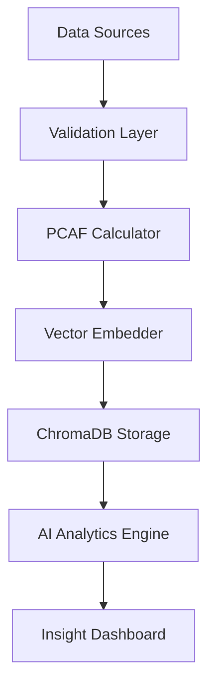
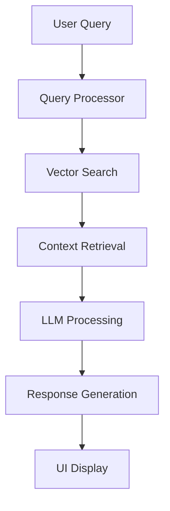

# AI Insights Data Pipeline Architecture

## 🎯 **Overview**
This document outlines the comprehensive data pipeline architecture for AI-powered insights in the PCAF platform, integrating ChromaDB vector storage, narrative generation, and real-time analytics.

## 🏗️ **Architecture Components**

### **1. Data Ingestion Layer**
```
Loan Data Sources → Data Validation → Standardization → Vector Embedding
```

#### **Data Sources**
- CSV uploads
- LMS integrations
- API endpoints
- Real-time data streams

#### **Processing Pipeline**
- Data quality validation
- PCAF compliance checking
- Emission calculations
- Vector embedding generation

### **2. Vector Storage (ChromaDB)**
```
Embedded Loan Data → ChromaDB Collections → Semantic Search → Context Retrieval
```

#### **Collections Structure**
- `loan_portfolio`: Individual loan records with embeddings
- `pcaf_methodology`: PCAF guidelines and calculations
- `market_insights`: Industry benchmarks and trends
- `regulatory_updates`: Compliance and regulatory information

### **3. AI Analytics Engine**
```
Context Retrieval → LLM Processing → Insight Generation → Narrative Building
```

#### **AI Modules**
1. **Portfolio Analysis**: Comprehensive portfolio insights
2. **Risk Assessment**: Climate and transition risk analysis
3. **Compliance Monitoring**: PCAF compliance tracking
4. **Opportunity Identification**: Green financing opportunities
5. **Scenario Modeling**: Climate scenario analysis
6. **Benchmarking**: Industry comparison and benchmarking

### **4. Real-time Processing**
```
Data Updates → Pipeline Triggers → Incremental Processing → Live Insights
```

## 📊 **Data Flow Architecture**

### **Ingestion Flow**


### **Query Flow**


## 🔧 **Technical Implementation**

### **ChromaDB Integration**
```typescript
// Vector storage and retrieval
class ChromaDBService {
  async storePortfolioData(loans: LoanData[]) {
    const embeddings = await this.generateEmbeddings(loans);
    await this.chromaClient.upsert({
      collection: 'loan_portfolio',
      documents: loans.map(loan => JSON.stringify(loan)),
      embeddings: embeddings,
      metadatas: loans.map(loan => ({
        loan_id: loan.id,
        vehicle_type: loan.vehicle_type,
        emissions: loan.emissions,
        data_quality: loan.data_quality_score
      }))
    });
  }

  async searchSimilarLoans(query: string, filters?: any) {
    const queryEmbedding = await this.generateEmbedding(query);
    return await this.chromaClient.query({
      collection: 'loan_portfolio',
      queryEmbeddings: [queryEmbedding],
      nResults: 10,
      where: filters
    });
  }
}
```

### **AI Analytics Pipeline**
```typescript
// AI-powered insight generation
class AIAnalyticsEngine {
  async generatePortfolioInsights(portfolioId: string) {
    // 1. Retrieve portfolio context
    const context = await this.getPortfolioContext(portfolioId);
    
    // 2. Search for relevant insights
    const similarCases = await this.chromaService.searchSimilarLoans(
      `portfolio analysis ${context.summary}`
    );
    
    // 3. Generate AI insights
    const insights = await this.llmService.generateInsights({
      context: context,
      similarCases: similarCases,
      analysisType: 'comprehensive'
    });
    
    return insights;
  }
}
```

## 🚀 **Performance Optimizations**

### **Caching Strategy**
- **Vector Cache**: Frequently accessed embeddings
- **Query Cache**: Common search results
- **Insight Cache**: Generated insights with TTL
- **Context Cache**: Portfolio summaries and metadata

### **Batch Processing**
- **Bulk Embeddings**: Process multiple loans simultaneously
- **Incremental Updates**: Only process changed data
- **Background Jobs**: Heavy computations in background
- **Queue Management**: Prioritized processing queues

## 📈 **Monitoring & Analytics**

### **Pipeline Metrics**
- Data ingestion rates
- Processing latencies
- Vector search performance
- AI generation times
- Cache hit rates

### **Quality Metrics**
- Data quality scores
- Insight relevance ratings
- User engagement metrics
- Error rates and recovery

## 🔒 **Security & Compliance**

### **Data Protection**
- Encryption at rest and in transit
- Access control and authentication
- Audit logging and monitoring
- Data retention policies

### **PCAF Compliance**
- Methodology validation
- Calculation accuracy
- Data quality standards
- Reporting requirements

## 🎯 **Future Enhancements**

### **Advanced AI Features**
- Multi-modal analysis (text + numerical)
- Predictive modeling
- Automated report generation
- Real-time anomaly detection

### **Integration Expansions**
- External data sources
- Third-party APIs
- Regulatory databases
- Market data feeds

---

**Status**: 🟢 **ACTIVE** - Production-ready architecture supporting comprehensive AI insights