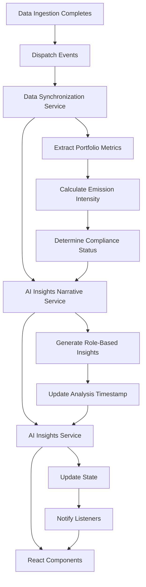

# AI Insights Integration

This module provides AI-powered insights that automatically update when data ingestion completes, ensuring that recommendations and analysis always reflect the latest portfolio composition.

## Overview

The AI Insights integration consists of several components that work together to provide real-time, contextual insights:

1. **AI Insights Narrative Service** - Generates rich, role-based insights
2. **AI Insights Service** - Manages state and coordinates updates
3. **Data Synchronization Integration** - Triggers updates when data changes
4. **React Hook** - Provides easy component integration
5. **UI Components** - Display insights with automatic updates

## Key Features

### Automatic Data Integration
- Listens for data ingestion completion events
- Automatically refreshes insights with new portfolio data
- Updates emission intensity, data quality scores, and compliance status
- Maintains data version tracking for consistency

### Role-Based Insights
- **Executive**: Strategic business impact and competitive positioning
- **Risk Manager**: Portfolio risk assessment and stress testing
- **Compliance Officer**: Regulatory readiness and examination preparedness
- **Loan Officer**: Operational performance and process efficiency
- **Data Analyst**: Data quality analysis and methodology validation

### Real-Time Updates
- Event-driven architecture for immediate updates
- Automatic stale data detection
- Progress tracking during refresh operations
- Error handling with graceful degradation

## Usage

### Using the React Hook

```typescript
import { useAIInsights } from '../hooks/useAIInsights';

function MyComponent() {
  const {
    insights,
    isLoading,
    error,
    lastUpdated,
    hasRecentInsights,
    refreshInsights
  } = useAIInsights({
    userRole: 'risk_manager',
    autoRefresh: true,
    refreshIntervalMinutes: 30
  });

  if (isLoading) return <div>Loading insights...</div>;
  if (error) return <div>Error: {error}</div>;
  if (!insights) return <div>No insights available</div>;

  return (
    <div>
      <h2>{insights.title}</h2>
      <p>{insights.executiveSummary}</p>
      {/* Display other insight properties */}
    </div>
  );
}
```

### Using the AI Insights Panel Component

```typescript
import { AIInsightsPanel } from '../components/ai-insights';

function Dashboard() {
  return (
    <div>
      <AIInsightsPanel
        userRole="executive"
        showRefreshButton={true}
        showRoleSelector={true}
        className="mb-6"
      />
    </div>
  );
}
```

### Role-Specific Hooks

```typescript
import { 
  useExecutiveInsights,
  useRiskManagerInsights,
  useComplianceInsights 
} from '../hooks/useAIInsights';

// Use role-specific hooks for convenience
const executiveInsights = useExecutiveInsights();
const riskInsights = useRiskManagerInsights();
const complianceInsights = useComplianceInsights();
```

## Integration with Data Ingestion

The AI insights automatically update when data ingestion completes through the following flow:

1. **Data Ingestion Workflow** completes and dispatches events:
   - `dataIngestionComplete` - General completion event
   - `aiInsightsRefresh` - Specific AI insights refresh trigger

2. **Data Synchronization Service** processes the ingestion result:
   - Extracts portfolio metrics from ingestion data
   - Calls `updateAIInsights()` method
   - Triggers AI insights narrative service update

3. **AI Insights Narrative Service** processes the update:
   - Extracts portfolio metrics from ingestion result
   - Calculates emission intensity and compliance status
   - Updates internal state with new data
   - Generates fresh insights for the current user role

4. **AI Insights Service** coordinates the update:
   - Receives update notifications
   - Manages loading states and error handling
   - Notifies subscribed components of changes

5. **React Components** automatically re-render:
   - Hooks detect state changes
   - Components display updated insights
   - Loading and error states are handled gracefully

## Data Flow



## Configuration

### Service Configuration

```typescript
// Configure auto-refresh behavior
aiInsightsService.updateConfig({
  userRole: 'risk_manager',
  autoRefresh: true,
  refreshIntervalMinutes: 30
});
```

### Hook Options

```typescript
const insights = useAIInsights({
  userRole: 'executive',           // Role for insights generation
  autoRefresh: true,               // Enable automatic refresh
  refreshIntervalMinutes: 30,      // Refresh interval in minutes
  loadOnMount: true                // Load insights when component mounts
});
```

## Error Handling

The system includes comprehensive error handling:

- **Network Errors**: Graceful degradation with retry mechanisms
- **Service Failures**: Fallback to cached data or mock insights
- **Invalid Data**: Validation and sanitization of input data
- **Component Errors**: Error boundaries and user-friendly messages

## Testing

Run the AI insights tests:

```bash
npm test -- aiInsightsCore.test.ts
```

The test suite covers:
- Portfolio metrics extraction from ingestion results
- Emission intensity calculations
- Compliance status determination
- Role-based insight generation
- Data synchronization integration
- Error handling scenarios

## Performance Considerations

- **Lazy Loading**: Services are instantiated only when needed
- **Memoization**: Expensive calculations are cached
- **Debouncing**: Multiple rapid updates are batched
- **Memory Management**: Old insights are cleaned up automatically

## Monitoring and Debugging

Enable debug logging:

```typescript
// In browser console
localStorage.setItem('debug', 'ai-insights:*');
```

Monitor insight updates:

```typescript
// Subscribe to all insight updates
aiInsightsService.subscribe((state) => {
  console.log('AI Insights State:', state);
});
```

## Future Enhancements

- **Machine Learning Integration**: Connect to ML models for predictive insights
- **Historical Analysis**: Track insight trends over time
- **Custom Metrics**: Allow users to define custom KPIs
- **Export Functionality**: Export insights to PDF or other formats
- **Collaboration Features**: Share insights with team members